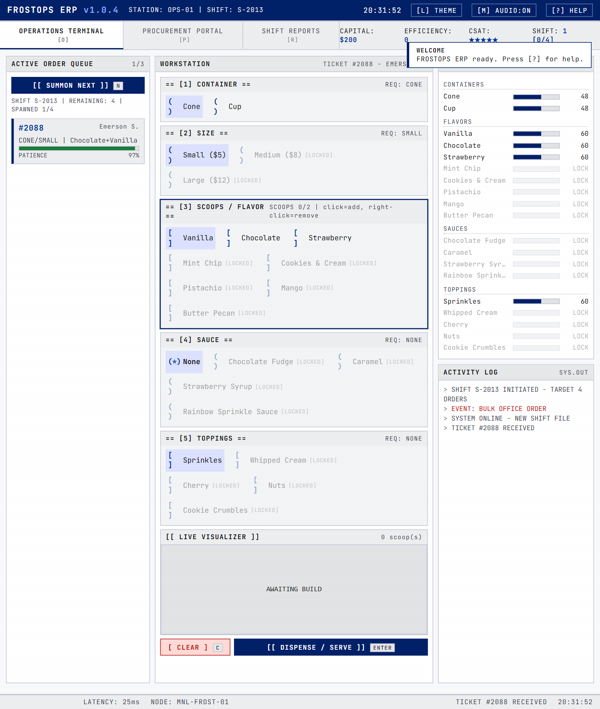
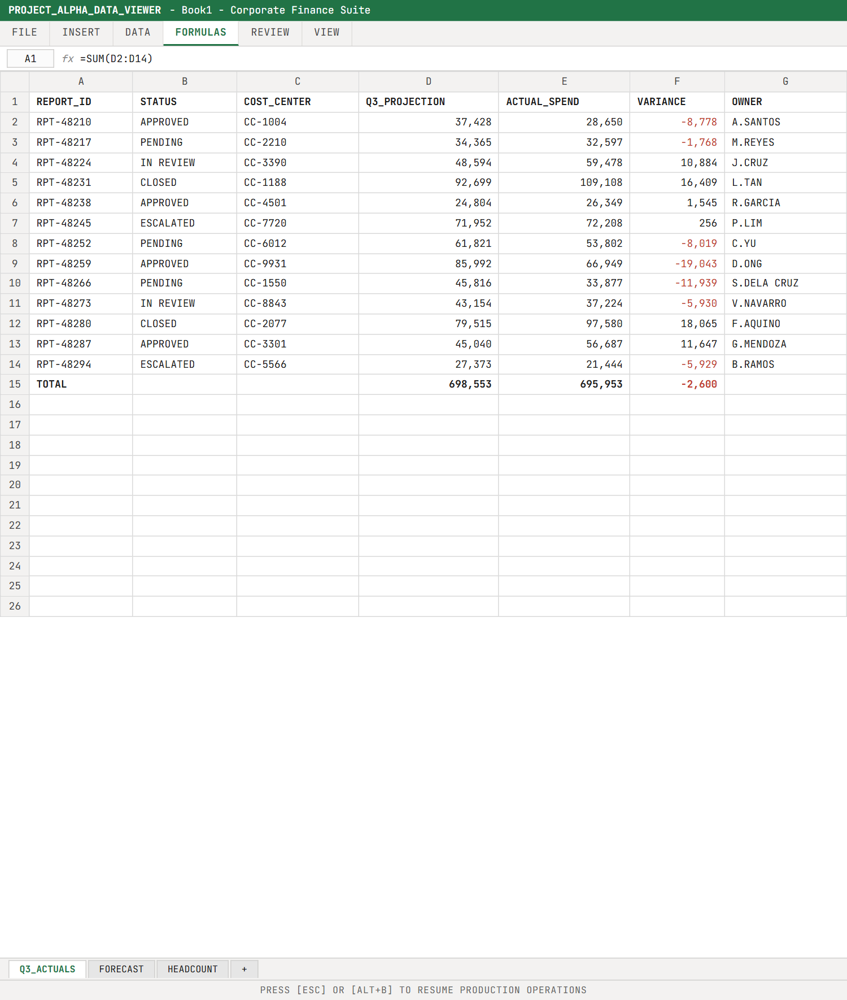
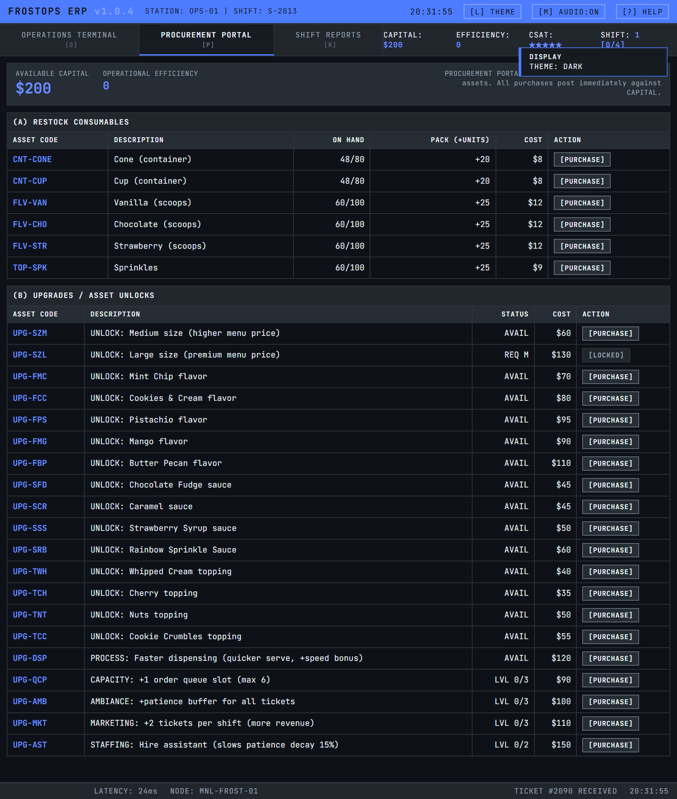
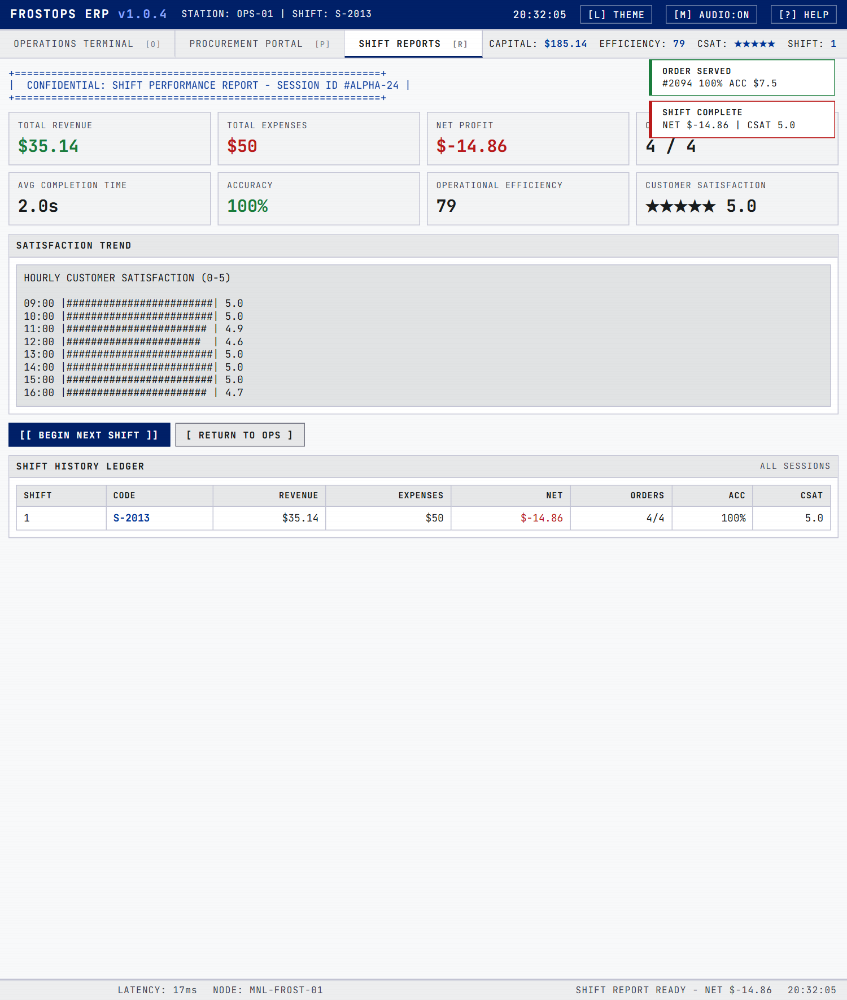

# FrostOps ERP

> A silly little browser game that pretends to be boring enterprise software.

**FrostOps** looks like a frozen-dessert logistics terminal: tables, borders, status codes, a blinking `SYSTEM_LIVE` dot, and a very serious "OPERATIONAL EFFICIENCY" metric. It is actually an ice-cream-shop management game in the spirit of Papa's Pizzeria, dressed up as an internal ops dashboard so it reads as "work" at a glance.

It is made purely for fun. It is not real software, it is not affiliated with anyone, and it does not do anything useful. That is the whole joke.

### Play it now
**Live demo: https://riegodavid-git.github.io/frostops/**

No install, no sign-up, no account. It runs entirely in your browser and saves your progress locally on your own machine.

---

## What it is

You run a shift at a "frozen dessert operations" counter. Work orders (customers) show up in a queue, each with a patience meter ticking down. You build each order at the WORKSTATION to match what was requested, then DISPENSE. Accuracy and speed drive your revenue and your customer satisfaction rating. Between shifts you restock ingredients and unlock new flavors, sizes, and upgrades in the PROCUREMENT PORTAL. Rent is charged at the end of every shift, so you have to actually stay profitable.

Everything is text and ASCII. There is no pixel art, no sprites, no color-splash graphics: just a clean, dense, monospace "terminal" that happens to be a game.

### The fake-office bit
The disguise is half the fun, so the game speaks fluent corporate:

| The game calls it | It really means |
| --- | --- |
| DAILY REVENUE / CAPITAL | your money |
| OPERATIONAL EFFICIENCY | your score / XP |
| CUSTOMER SATISFACTION | your rating (lives) |
| STOCK MANAGEMENT | inventory |
| PROCUREMENT PORTAL | the shop |
| WORK ORDERS / TICKETS | customers |
| EMPLOYEE PERFORMANCE INCREASED | you leveled up |

And yes, there is a **boss key**. Press `Alt+B` and the whole thing flips instantly to a completely convincing spreadsheet ("PROJECT_ALPHA_DATA_VIEWER") with a formula bar, ribbon tabs, and quarterly variance figures. Press `Esc` to get back to scooping.

---

## Screenshots

**Operations Terminal** (the main game): summon a work order, build it, dispense.

**Boss key** (`Alt+B`): instant, boring, extremely plausible spreadsheet.

**Procurement Portal** (dark theme): restock ingredients and unlock upgrades.

**Shift Performance Report** (end of day): a fake business report with your numbers.

---

## How to play

1. A work order is auto-selected from the queue on the left. Read what it wants (container, size, scoops, sauce, toppings).
2. Build it in the WORKSTATION: pick a container, a size, the right scoops, sauce, and toppings.
3. Hit DISPENSE before the patience meter runs out.
4. Get paid based on how accurate and how fast you were. Repeat until the shift ends.
5. Visit the PROCUREMENT PORTAL to restock and to unlock new flavors, sizes, sauces, toppings, and upgrades (faster dispensing, bigger queue, more foot traffic, and so on).
6. Survive rent, ride out random events (rush hour, supplier delays, VIP inspections, happy hour), and grow the operation shift by shift.

### Controls (keyboard-first)

| Key | Action |
| --- | --- |
| `O` / `P` / `R` | Operations / Procurement / Reports |
| `N` | Summon or select the next work order |
| `1`-`5` | Focus a workstation section |
| `Tab` | Cycle sections |
| `Up` / `Down` | Move the highlight in a section |
| `Space` | Toggle or confirm the highlighted option |
| Click a flavor | Add a scoop (right-click removes one) |
| `Enter` | Dispense / serve the current order |
| `C` | Clear the current build |
| `Alt+B` | Boss key (Esc closes it) |
| `Esc` | Close any overlay |
| `M` | Mute / unmute |
| `L` | Toggle light / dark theme |
| `?` | Help |

---

## Tech notes

- One self-contained `index.html`. Vanilla JavaScript and CSS, no frameworks, no build step.
- Works fully offline. The only external reference is an optional web font that gracefully falls back to your system monospace.
- Saves to `localStorage` on your machine. Nothing is uploaded anywhere. There is no server and no tracking.
- Sound effects are synthesized in the browser (Web Audio) and can be muted anytime.

## Run it locally

Just open `index.html` in any modern browser. That is it. (If your browser is fussy about `localStorage` on `file://`, serve the folder instead: `python -m http.server 8000` and open `http://localhost:8000`.)

---

*Made for fun. Look busy.*
